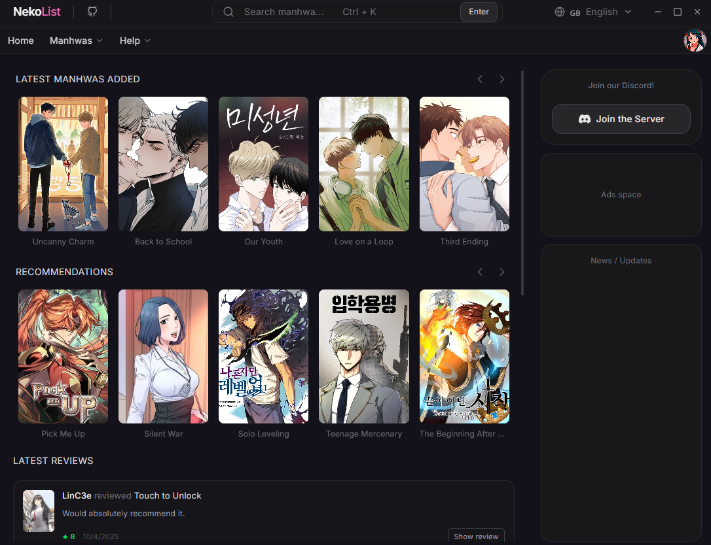
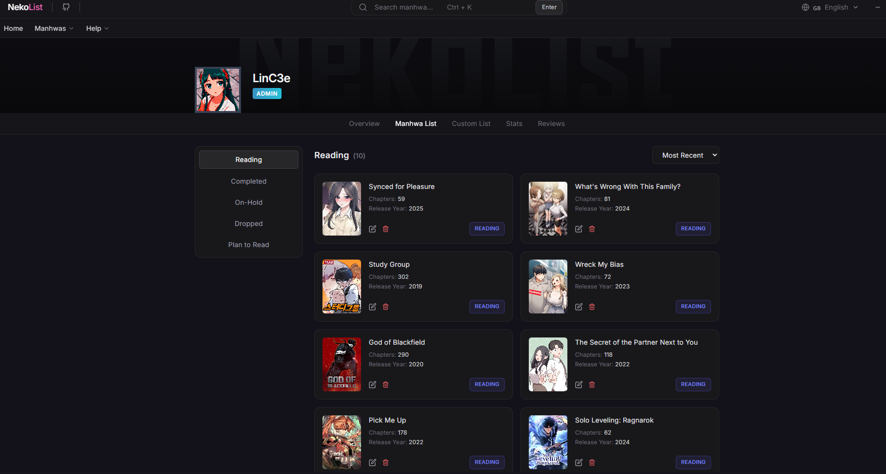
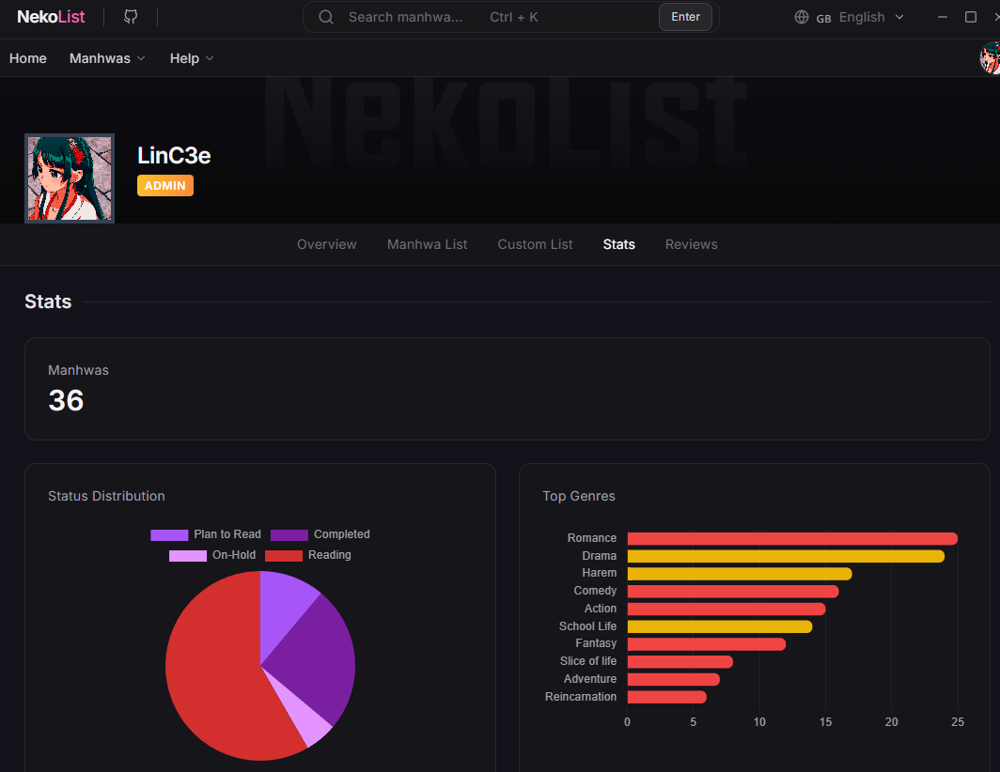

# NekoList

**Organize and track your favorite manhwas in a modern desktop application.**

 

    

---

## 📸 Screenshots

    
      
    
      
    

---

## ✨ Why use NekoList?

- 📚 **Track your reading progress** with ease.
- 🎨 **Modern and clean interface** designed for daily use.
- ⚡ **Fast and lightweight** desktop experience.
- 📈 **Manage your personal library** efficiently.
- ❤️ **Built with passion by the community.**

---

<strong>⌨️ Keyboard Shortcuts</strong>

 

| Shortcut | Action |
|----------|---------|
| `Ctrl + K` | Open Search Bar |

---

## 🐛 Known Issues

If you find a bug or unexpected behavior, please open an issue and include as much detail as possible.

---

## 💬 Community

- Join our Discord server for support and discussions.
- Use GitHub Issues to report bugs.
- Use GitHub Discussions to suggest new features.

---

## ☕ Support the Project

If NekoList is useful to you, consider supporting its development through Ko-fi.

Thank you for helping improve the project ❤️